# I - Environnement de développement
## 01. IDE or Text Editor ? (VSC, Vim, emacs, nano, Notepad++, outils Jetbrains, repl.it, etc.)
## 02. Environnement virtuel (virtualenv (python), RVM (ruby), etc.)
## 03. Notebook interface: Jupyter, Colaboratory, etc.
## 04. Package manager : conda (anaconda), npm (node), pip (python), etc.
## 05. Raccourcis de productivité

# II - Les types de données

## 01. La table ASCII

## 02. Les caractères d'échappement

## 03. Les opérateurs arithmétiques :
|Opérateur|Signification|Meaning|Python example|
|---------|-------------|-------|-------|
|a+b|Addition|Addition|5+2=7|
|a-b|Soustraction|Substraction|5-2=3|
|a.b|Multiplication|Multiplication|5&ast;2=10|
|a^b|Puissance|Exponentiation|5&ast;&ast;2=25|
|a/b|Division|Division|5/2=2.5|
|⌊a/b⌋|Division entière|Floor Division|5//2=2|
|a%b|Modulo|Modulus|5%2=1|

# III - Structures conditionnelles
##  01. Les opérateurs relationnels (outils de comparaison)
|Opérateur|Signification|
|-------|-------------|
|>|supérieur à|
|<|inférieur à|
|≤|supérieur ou égal à|
|≤|inférieur ou égal à|
|=|égal à|
|≠|différent de|

## 02. Les opérateurs logiques
|Opérateur|Signification|
|---------|-------------|
|NOT|L'opérateur "NOT" (NON en français) permet d'évaluer une expression à vrai si le test est faux|
|AND|L'opérateur "AND" (ET en français) permet d'évaluer une expression à vrai si chacun des tests sont vrais|
|OR|L'opérateur "OR" (OU Inclusif en français) permet d'évaluter une expression à vrai si au moins un test est vrai|
|XOR|L'opérateur "XOR" (OU eXclusif en français) permet d'évaluer une expression à vrai si seulement un test est vrai|

## 03. Les boucles : while / do…while (repeat… until) & for.
## 04. Les conditions : if…else & switch.
## 05. Contrôle de boucles : repeat, break, next, continue, pass & txtProgressBar.

# IV - Les principaux paradigmes de programmation
|Paradigm|Description|
|--------|-----------|
|Machine Code|Represents the instructions (the contents of program memory) as a sequence of numbers, and assembly language where the machine instructions are represented by mnemonics and memory addresses can be given symbolic labels|
|Imperative|Programs as statements that directly change computed state|
|Sturtured|A style of imperative programming with more logical program structure|
|Procedural|Derived from structured programming, based on the concept of modular programming|
|Functional|Treats computation as the evaluation of mathematical functions avoiding state and mutable data|
|Event-driven|Control flow is determined mainly by events, such as mouse clicks or interrupts including timer|
|Object-oriented|Treats datafields as objects manipulated through predefined methods only|
|Declarative|Defines program logic, but not detailed control flow|
|Automata-based progrmaming|Treats programs as a model of a finite state machine or any other formal automata|

## L'évolution des paradigmes de programmations rendent d'avantage le code : modulaire, réutilisable et évolutif

# V - Fonctions, procédures, arguments et techniques d'algorithmies
## Les fonctions
Les fonctions ont pour principe d'effectuer une action puis de retourner une valeur.
## Les procédures
Les procédures ont pour principe d'effectuer une action sans retourner de valeur.
## Les arguments
Les arguments sont des variables qui peuvent être passées en paramètre des fonctions ou procédures, afin de personnaliser le résultat.
## Les algorithmes itératifs
L'itération est une technique d'algorithmie qui à partir d'une boucle, effectue une opération jusqu'à un point d'arrêt pré-défini.
## Les algorithmes récursifs
La récursivité est une technique d'algorithmie qui à partir d'un appel de fonctions vers elle-même, effectue une opération jusqu'à un point d'arrêt pré-défini.

# VI - Built-in functions
La fonction map : permet d'effectuer une opération sur chaque élément d'un tableau (ou une liste en python).

# VII - Les librairies principales

# VIII - Les bonnes pratiques
##	01. Connaitre les point forts et les points faibles du langage qu'on utilise
##	02. Apprendre à bien commenter son code
### 02.A. Single Line Comment
### 02.B. Multi Line Comment
### 02.C. Documentation Comment
## 03. Bien nommer ses variables
## 04. Respecter les conventions de nommage (classe, méthode, fonctions, constante, variable, module, package, etc.) associé au langage
|Convention Name|Example|
|---------------|-------|
|Pascal Case|FirstName|
|Camel Case|firstName|
|Screaming Case|FIRSTNAME|
|Snake Case|first_name|
|Kebab case|first-name|
|Hungarian Notation|strFirstName|
## 05. Le portage de code (code porting)
Parfois le code source d'un projet peut devenir obsolète (legacy code), c'est là où le portage entre en jeu, cela conciste à réécrire un vieux composant ou même un projet entier, avec dans une version avancé du langage ou carrément dans un tout autre langage. 
## 06. Le remaniment de code (code refactoring)
Le refactoring est une tâche récurrente dans la vie d'un développeur, cela consite simplement à améliorer la qualité et la performance du code.
## 07. La réécriture de code (code rewrite)
Parfois le code est tellement mal fait (variables mal nommées, peu/pas de commentaires, projet mal organisé, etc.) que la réécriture du code peut-être préférable car parfois cela pourrait prendre moins de temps que de tout corriger.

# IX - Les langages interprétés vs compilés + Input/Output
## 01. La compilation

## 02. L'interprétation

# X - OOPs (Object-Oriented Programming System)
## 01. Class, factory and objects
### Avec une classe abstraite, on ne peux pas créer d'objet.

### 02. Inheritance

## 03. Polymorphism

## 04. Abstraction 

## 05. Encapsulation (public, private, protected & package)
### Publique : Accessible partout. Notation '+'.
### Protégé : Accessible uniquement au sein de la classe elle-même et par les classes filles et parent. Notation '#'.
### Privé : Accessible uniquement par le groupe qui définit le membre. Notation '-'.
### Package : Accessible pour les éléments qui sont dans le même package. Notation '~'.

## 06. Coupling vs Cohesion

## 07. Association (show multiplicity)

## 08. Aggregation (has)
### L'objet esclave est indépendant et ne sera pas supprimé si l'objet maître est supprimé.

## 09. Composition (owns)
### L'objet esclave est supprimé si l'objet maître est supprimé.

## 10. Generalization and specialization

## 11. Dependency (uses)

## 12. Realizaion / Implementation

# XI - Développement web
## 01. La standardisation W3C, ECMAScript, RFC, etc.
## 02. CMS (Content Management System) : 
|Popularity|Name|
|----------|----|
|#1|WordPress|
|#2|Drupal|
|#3|Shopify|
## 03. Le marketing digital
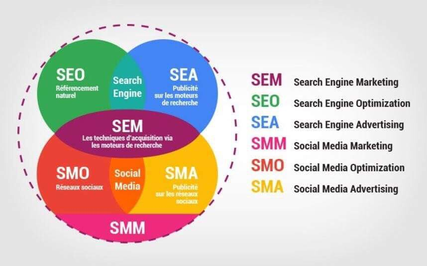
## 04.	Front-end technologies :

## 04.A. Qu’est-ce que le DOM (Document Object Model)

## 04.B. HTML
### 04.B.a. Les balises fondamentales HTML :
|Tag name|Definition|
|--------|----------|
|html|root container|
|head|metadata container|
|title|Title|
|meta|metadata|
|link|link to external style sheet|
|body|document container|
|h1-h6|Heading|
|img|Image|
|p|Paragraph|
|span|Text container|
|div|Division|
|ul|Unordered List|
|ol|Ordered List|
|li|List Item|
|table|Table container|
|tr|table row|
|th|table header|
|td|table data|
|nav|Navigation container|
|article|Article container|
|header|Header container|
|footer|Footer container|
|em|Emphasis text|
|b|Bold text|
|strong|Strong text|
|i|italic text|
|small|Small text|
|u|underline|
|strike|Deleted text|
|a|anchor|
|hr|Horizontal Rule|
|script|execute or link to external script|
|form|Défini un formulaire|
|label|Défini une étiquette|
|input|Défini une saisie|
|button|Défini un bouton|
|...|...|
### 04.B.b. Les attributs HTML
## 04.C. CSS
### 04.C.a. Les sélecteur CSS : 
|Selector|Syntax|Description|
|--------|------|-----------|
|element selector|element {}|Sélection d'un type d'élément|
|multiple element selector|element1, element2 {}|Sélection de plusieurs élements|
|star selector|* {}|Sélection de tous les éléments|
|id selectors|#idName {}|Sélection sur un id unique|
|class selectors|.className {}|Sélection sur une classe|
|attribute selector|element[attribute=value] {}|Sélection à partir de son attribut|
|Descendant selector|element1 element2 {}|Sélection des éléments contenu dans l'élément ancestre|
|Child selector|element1>element2 {}|Sélection des éléments d'un élément parent|
|Adjacent sibling selector|element1+element2 {}|Sélection de l'élément qui est précédé d'un autre élément|
|General sibling selectors|element1~element2 {}|Sélection de tous les élément précédé d'un autre élément|
|Pseudo-classes|selector:pseudo-class {}|Sélection à partir de l'état de l'élément|
|Pseudo-element|selector::pseudo-element {}|Sélection d'un fragment d'un élément|
|nth-of-type|element:nth-of-type(n) {}|Sélection des éléments d'un type donné, en fonction de leur position au sein d'un groupe de frères et sœurs|
|nth-child|element:nth-child(n) {}|Sélection des éléments basés sur leur position dans un groupe de frères et sœurs|
### 04.C.b. Les propriétés fondamentales CSS
|Propriété CSS|Description|Valeurs|
|-------------|-----------|-------|
|marging|Marge vers l'extérieur|margin-top, margin-right, margin-bottom & margin-left|
|padding|Marge vers l'intérieur|padding-top, padding-right, padding-bottom & padding-left|
|border|Créer un cadre visible|border-width, border-style, border-color, initial & inherit|
|font-family|Définir la police d'écriture|family-name/generic-family, initial	& inherit|
|font-size|Définir la taille de la police|medium, xx-small, x-small, small, large, x-large, xx-large, smaller, larger, length, initial & inherit|
|font-style|Définir le style de police|normal, italic, oblique, initial & inherit|
|font-weight|Défini l'épaisseur de la police|normal, bold, bolder, lighter, number, initial & inherit|
|color|Défini la couleur d'un élément|color, rgb(), rgba(), #xxx, #xxxxxx, hsl(), hsla()|
|display|Comportement d'affichage|block, inline-block, inline, none, flex, grid, ...|
|width|Largeur|auto, %, initial, inherit, px, cm, ...|
|height|Hauteur|auto, %, initial, inherit, px, cm, ...|
|float|Permet de faire flotter un élément|none, left, right, initial & inherit|
|background-color|Défini la couleur de fond|color, rgb(), rgba(), #xxx, #xxxxxx, hsl(), hsla()|
|background-image|Défini une image de fond|url("local path or web link")|
|position|Défini le type de positionnement|static, relative, absolute, fixed, sticky, initial & inherit|
|z-index|Défini l'ordre de chevauchement des éléments|auto, -1, 0, 1, 2, ...|
|...|...|
### 04.C.c. Les préprocesseur CSS
|Préprocesseur CSS|
|-----------------|
|SASS (Syntactically Awesome Style Sheet)|
|LESS (Leaner Style Sheets)|
|Stylus|
### 04.Cd Framework CSS (il est généralement préférable d'utiliser CSS) : 
|Popularity|Name|
|----------|----|
|#1|Bootstrap|
|#2|Semantic UI|
## 04.D. JavaScript (Vanilla) :
### 04.D.a. Dynamisation des pages
### 04.D.b. Manipulation du DOM 
### 04.D.c. Les fonctions à flèches depuis l’ES6.
### 04.D.d. L’asynchronisme avec les promesses (promise, resolve, reject)
### 04.D.e. Framework JS : 
|Popularity|Name|
|----------|----|
|#1|React|
|#2|Angular|
|#3|Vue|
## 04.E.	Créer une maquette (tous les écrans d’une app) et les coder
|Popularity|Name|
|----------|----|
|#1|Adobe XD (Windows et Mac)|
|#2|Sketch (Mac) |
## 04.F. SPA (Single Page Application) vs MPA (Multi Page Application)
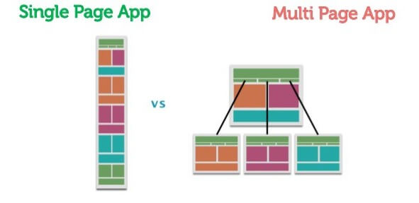
## 04.G jQuery
Technologie devenue obsolète, javascript natif est à utiliser.

## 05. Back-end technologies :  

### 05.A. Server framework :
#### 05.A.a. Node : (Jest, Mocha, Jasmine, Karma, selenium, etc)
|Popularity|Name|
|----------|----|
|#1|Express|
|#2|Meteor|
#### 05.A.b. Python : (unittest, selenium, etc)
|Popularity|Name|
|----------|----|
|#1|Django|
|#2|Flask|
#### 05.A.c. PHP : (testunit, etc)
|Popularity|Name|
|----------|----|
|#1|Laravel|
|#2|Symfony|
#### 05.A.d. Java : (JUnit, selenium, etc)
|Popularity|Name|
|----------|----|
|#1|Spring|
#### 05.A.e. C# : (MSTest, selenium, etc)
|Popularity|Name|
|----------|----|
|#1|ASP.NET|
### 05.B. Les architecture web : 
#### 05.B.a MVC 

#### 05.B.b MVT (django)
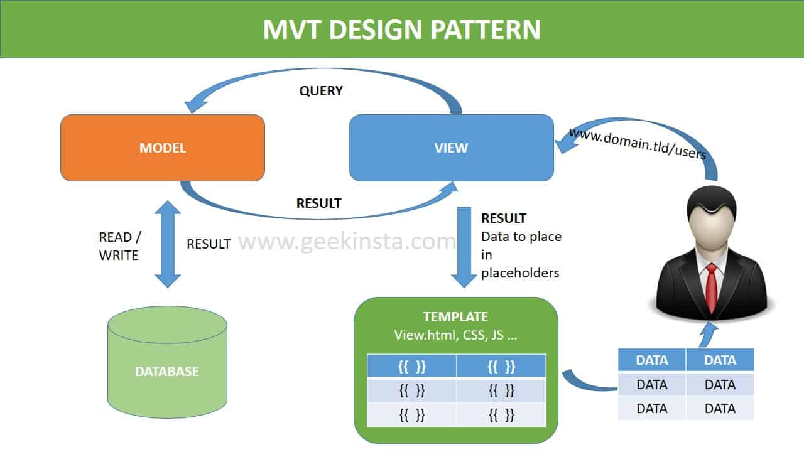
### 05.C. Web services (deux grandes familles) :
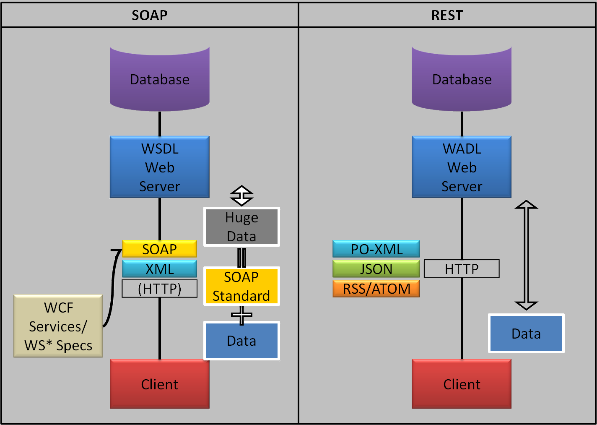
|Acronym|Meaning|
|-------|-------|
|SOAP|Simple Object Access Protocol|
|XML|eXtensible Markup Language|
|REST|REpresentational State Transfer|
|JSON|JavaScript Object Notation|
### 05.D. Communication client/serveur 
### 05.D.a. La méthode AJAX (Asynchronous JavaScript And XML)

### 05.D.b. Les protocoles internet :

### 05.D.c. HTTP request

### 05.D.d. HTTP methods

### 05.D.e. HTTP status code

### 05.D.f. HTTPS
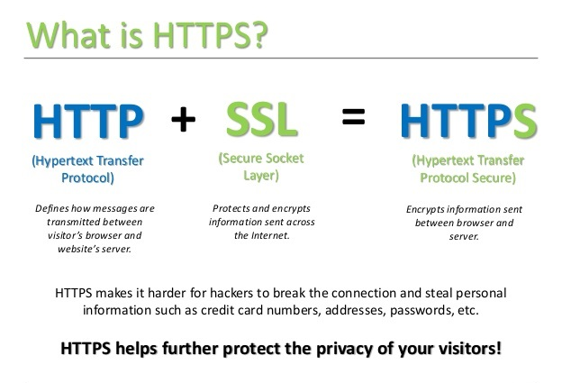
### 05.D.g. HTTP/1 vs HTTP/2

### 05.D.h. Le modèle OSI et le modèle TCP/IP

### 05.D.i.  Duplex (canal de communication)

#### 05.D.i. - Les Websockets sont une spécification full-duplex du protocole HTTP.
##### 05.D.i. • Utilisé pour le développement de messagerie instantanée.
## 06. Payload (Charge utile) : la charge symbolise les données utiles transportées par un protocole.

# XII - Base de données 
## 01. RDBMS / SGBDR :

### 01.A. Propriétaire : 
|Popularity|Name|
|----------|----|
|#1|Oracle|
|#2|Micrsoft Server|
|#3|MySQL|
### 01.B. Libre : 
|Popularity|Name|
|----------|----|
|#1|PostegreSQL|
|#2|MariaDB|
|#3|SQLite|
## 02. OLTP (Online Transactional Processing) / OLAP (Online analytical processing)

## 03. SQL

### 03.A. Les jointures

## 04. NoSQL databases :

## 05. Cloud providers :

## 06. ORM (Object-Relational Mapping)
C'est un programme informatique qui permet de générer une base de données, ex: django, entity framework, hibernate, etc.
## 07. What is CRUD  ?
CRUD stand for create, read, update, and delete, they are the four basic functions of persistent storage.

# XIII - La mémoire : 

## 01. Allocation statique vs dynamique

### 01.A. Allocation dynamique
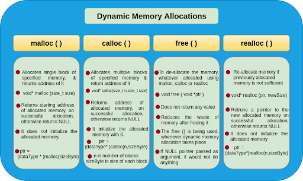
## 02. Stockage de la mémoire
### 02.A. Queue allocation (la file)
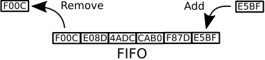
### 02.B. Stack allocation (la pile)

### 02.C. Heap allocation (le tas)
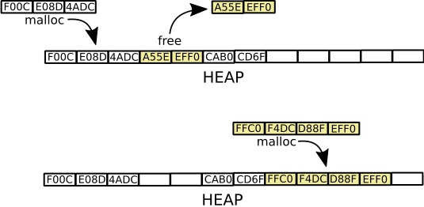
## 03. Les pointeurs

## 04. Espace mémoire et plage de données

## 05. Leaks (fuite) : C'est une erreur lorsque la mémoire n'a pas été libérée

# XIV - File management (read, write, append, create, etc.)
## 01. Les types de fichiers (TXT, CSV, JSON, PDF, etc.)

# XV - Les algorithmes (problems archives : https://projecteuler.net/archives)
## 01. Performances
### 01.A. Time complexity : C'est la mesure de la complexité d'un calcul en fonction de son nombre d'étapes, autrement dit son temps d'exécution.
### 01.B. Big OΘ notation : C'est une notation décrivant la complexité d'un calcul.
### 01.C. Space complexity : C'est la mesure de l'espace mémoire utilisé par un algorithme.
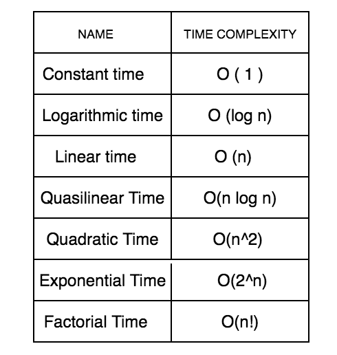
## 02. Les algorithmes pricipaux
### 02.A. Sort Algorithms
|Speed|Time Complexity|Sort algorithm|Algorithme de tri|
|-----|---------------|--------------|-----------------|
|#01|Θ(n)|Timsort (python built-in)|Timsort (python built-in)|
|#02|Θ(nk)|Radix sort|Tri par base|
|#03|Θ(nlog(n))|Quick sort (divide and conquer)|Tri rapide / Tri pivot (diviser pour régner)|
|#04|Θ(nlog(n))|Shell sort|Tri de Shell|
|#05|Θ(nlog(n))|Merge sort (divide and conquer)|Tri fusion (diviser pour régner)|
|#06|Θ(nlog(n))|Heap sort|Tri par tas|
|#07|Θ(n + k)|Counting sort|Tri comptage / Tri casier|
|#08|Θ(n + k)|Bucket sort|Tri par paquets|
|#08|Θ(n²)|Selection sort|Tri par sélection / Tri par extraction|
|#10|Θ(n²)|Insertion sort|Tri par insertion|
|#11|Θ(n²)|Bubble sort|Tri à bulles / Tri par propagation|
|#12|Θ(n²)|Cocktail sort|Tri cocktail|
### 02.B. Search Algorithms
|Search algorithm|Algorithme de recherche|
|----------------|-----------------------|
|Binary search|Recherche dichotomique|
|Depth First Search (DFS)|Algorithme de parcours en profondeur|
|Breadth First Search (BFS)|Algorithme de parcours en largeur|
|...|...|
### 02.C. Hashing
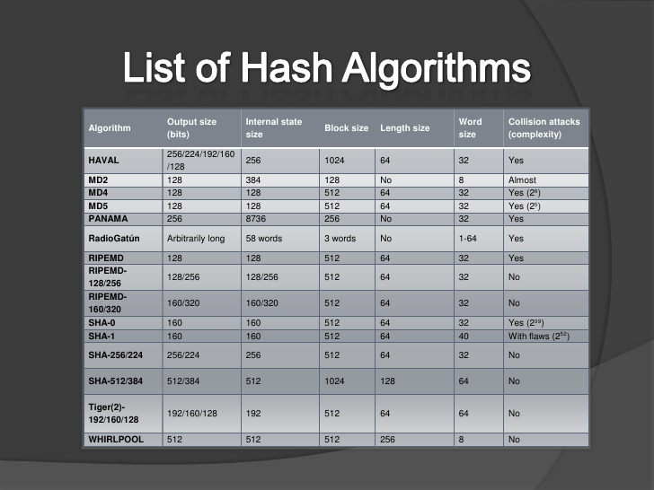
### 02.D. Dynamic Programming
### 02.E. Exponentiation by squaring
### 02.F. String Matching and Parsing (KMP Algorithm, Regular Expression)
### 02.G. Primality Testing Algorithms
### 02.H. Hashmap

# XVI - Testing
## 01. Pyramid : 

## 02. Autres :
### 02.A. Test fonctionnels et non fonctionnels
### 02.B. Smoke test and sanity check
### 02.C. Proof of Concept (PoC)
## 03. Exception Handling :
### 03.A. try… raise/catch/except…finally/except
### 03.B. throws…throw

# XVII - Patterns (les patrons)
## 01. Design pattern (patron de conception) :
Outils apportant des solutions aux problèmes communs de développement logiciel en rendant le code flexible, réutilisable et maintenable.
### Il existe 3 grand type de design pattern
#### 01.A. Creational « factory » : création
#### 01.B. Behavioral: comportemental
#### 01.C. Structural : structurante

## 02. Architectural pattern (patron d'architecture) :
Solutions de référence pour la conception d'architecture logicielle, semblable aux design patterns, sa portée est plus large.
Ces solutions permettent de décomposer un problèmes d'architecture récurrent en éléments simples.
Exemple : MVC, REST, P2P, etc.

# XVIII - Documentation logicielle
## 01. L'expression de besoin 
### 01.A. Définit le besoin du métier lors d'une demande.
## 02. Architecture / Conception : diagrammes UML)
### 02.A. Vue d'ensemble sur le logiciel. Elle inclut les relations à l'environnement et les principes à utiliser dans la conception et la réalisation des composants logiciels.
## 03. Technique
### 03.A. Documentation du code, algorithmes, interfaces, et interfaces de programmation (API).
## 04. Utilisateur
### 04.A. Manuels pour les utilisateurs, administrateurs systèmes et personnel de support.
## 05. Marketing
### 05.A. Instructions sur le produit et garantie promotionnelle.

# XIX - L’architecture des ordinateurs (Taxonomie de Flynn)
## 01. Single Instruction on Single Data

## 02. Multiple Instructions on Single Data

## 03. Single Instruction on Multiple Data

## 04. Multiple Instructions on Multiple Data 

# XX - Single-Thread vs Multi-Thread programming

# XXI - Synchronous vs Asynchronous programming 
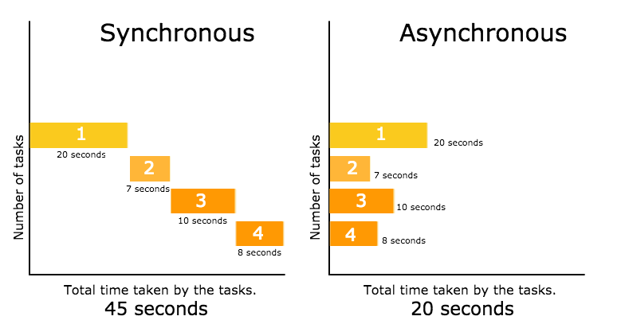

# XXII - Sequential vs Concurrent vs Parallel programming

# XXIII - DevOps
## 01. Git & Git CLI (#1 GitHub, #2 Gitlab, #3 Bitbucket, #4 Gitbucket)

## 02.  Semantic versioning

## 03. Linux

|Distribution|
|------------|
|Debian|
|Ubuntu|
|CentOS|
|Redhat|
|Arch Linux|
|Fedora|

### 03.C. Les scripts bash

## 04. Protocole SSH (Secure SHell)
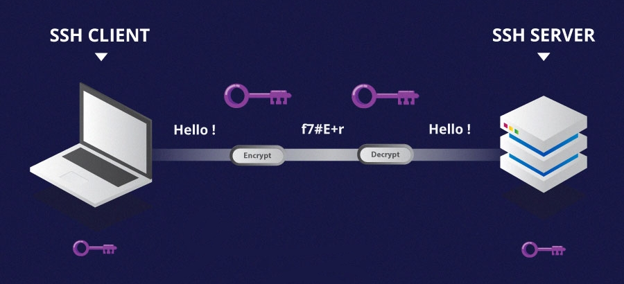
## 05. Les containers

## 06. CI / CD : Continuous Integrations / Countinuous Deployment
### 06.A. Ansible
### 06.B. Jenkins
## 07. Les tests automatisé : Selenium
## 08. Logiciels de virtualisation 
### 08.A. VirtualBox
### 08.B. VMWare
### 08.C. Vagrant : environnements de développement virtuel

# XXIV. Data Science

## 01. Types de données :
<table>
  <tr>
    <td colspan="4">Données quantitatives (numérique)</td>
    <td colspan="2">Données qualitative (catégorielles)</td>
  </tr>
  <tr>
    <td colspan="2">Données d'intervalles (zéro arbitraire)</td>
    <td colspan="2">Données de ratio (zéro identifiable)</td>
    <td colspan="1">Données ordinales</td>
    <td colspan="1">Données nominales</td>
  </tr>
  <tr>
    <td colspan="1">Continues : Peut prendre une infinité de valeur</td>
    <td colspan="1">Discrètes : Peut prendre une seule valeur entière</td>
    <td colspan="1">Continues : Peut prendre une infinité de valeur</td>
    <td colspan="1">Discrètes : Peut prendre une seule valeur entière</td>
    <td colspan="1">Peut être classé</td>
    <td colspan="1">Ne peut être mesuré ou comparé</td>
  </tr>
  <tr>
    <td colspan="1">Exemple : Température</td>
    <td colspan="1">Exemple : Date</td>
    <td colspan="1">Exemple : Distance</td>
    <td colspan="1">Exemple : Âge</td>
    <td colspan="1">Exemple : Niveau de satisfaction</td>
    <td colspan="1">Exemple : Couleurs</td>
  </tr>
  
</table>
 
## 02. Mathématiques
### 02.A. Linear algebra (algèbre linéaire)
#### 02.A.a. Matrix (matrice)
## 03. Statistiques
### 03.A. Mean (moyenne) : Résume une série de valeur en un seul nombre réel. Il s'agit de la somme des valeurs d'une série divisé par son nombre d'élément.
### 03.B. Median (Médiane) : Permet de partager une série de valeur en deux parties de même nombre d'élément. Il s'agit de la valeur du milieu d'une sérieu rangé par ordre croissant.
### 03.C. Mode (mode) : Permet de connaître la (ou les) valeur(s) la (ou les) plus fréquante(s) dans une série. Il s'agit d'une valeur ayant le plus de récurrence dans une série.
### 03.D. Variance (variance) : Mesure de la dispertion des valeurs d'unéchantillon ou d'une distribution de probabilité (sans tenir compte des signes).
### 03.E. Standard deviation (écart-type) :  Mesure de la dispertion des valeurs à partir de la moyenne.
### 03.F. Confidence Interval (Intervalle de confiance) : Défini une marge d'erreur dans un résultat. Le dégré de confiance est souvent défini à 95%, ce qui signifi qu'en moyenne, 95% des résultats seront correct.
### 03.G. Expected value (espérance) : Représente la valeur que l'on s'attend à trouver, en moyenne, si 'lon répète un grand nombre de fois la même expérience aléatoire. Il s'agit d'une moyenne pondérée par les probabilités d'apparition de chaque valeur.
### 03.H. Percentile (percentile) : Décrit la valeur à laquelle un pourcentage donné des valeurs est inférieur.
### 03.I. Quantiles : divisent un jeu de données en intervalles contenant le même nombre de données.
### 03.J. RMSE (ROOT MEAN SQUARE ERROR)
### 03.K. R-squared : mesure la qualité de la prédiction d'une régression linéaire, ainsi la qualité du model utilisé.
### 03.L. L'échatillonnage : On essaye de représenter une population à partir d'un sous ensemble. Les types d'échantillons sont : aléatoire, arbitraire, par itinéraire et par quotas.
### 03.M. p-value : est la probabilité pour un modèle statistique donné sous l'hypothèse nulle d'obtenir la même valeur ou une valeur encore plus extrême que celle observée.
## 04. Probabilité
### 04.A. Normal distribution / Gaussiandistribution (loi normal ou loi de Gauss) : La loi normale (ou loi de Gauss) permet de modéliser des phénomènes naturels issus de plusieurs évènements aléatoires.
### 04.B. Continuous uniform distribution / rectangular distribution (loi uniforme continue ou loi rectangulaire) : La loi uniforme continue (ou loi rectangulaire) a pour propriétéque la densité de probabilités deceslois est constante sur leur support.
### 04.C. Discrete uniform distribution (loi uniforme discrète) : La loi uniforme discrète est uneloi indiquantune probabilité de se réaliser identiqueà chaque valeur d'un ensemble fini de valeurs possibles.
### 04.D. Binomial distribution (loi binomiale) : La loi binomiale modélise la fréquence du nombre de succès obtenus lors de la répétition de plusieurs expériences aléatoires identiques et indépendantes.
### 04.E. Poisson distribution (loi de poisson) : La loi de poisson est une loi qui décrit le comportement du nombre d'évènement se produisant dans un intervalle de temps fixé.
## 05. Big Data
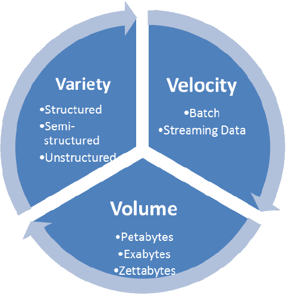
## 06. Intelligence artificielle

### 06.A. Les réseaux neuronaux
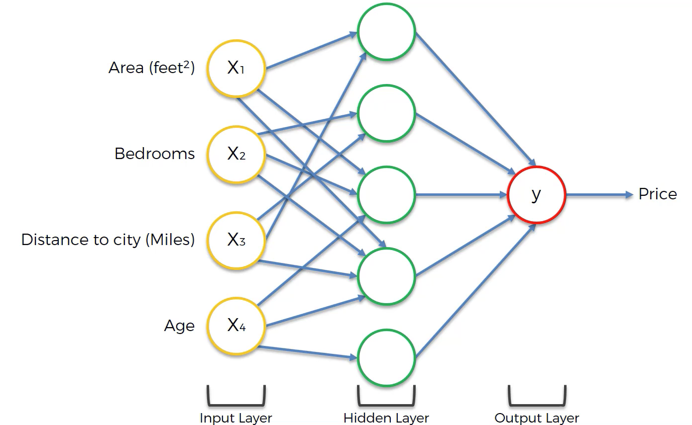
#### 06.A.a. Weight : importance de l'influence de l'input sur l'output
#### 06.A.b. Biais : constante d'ajustement
#### 06.A.c. Softmax activation
## 07. La blockchain
### Une blockchain est un registre, une grande base de données qui a la particularité d’être partagée simultanément avec tous ses utilisateurs, tous également détenteurs de ce registre, et qui ont également tous la capacité d’y inscrire des données, selon des règles spécifiques fixées par un protocole informatique très bien sécurisé grâce à la cryptographie.
|Proof of Work (POW)|Proof of Stake (POS)|
|-------------------|--------------------|

## 08. Time series
## 09. Machine learning :

### 09.A. Augmenter la précision du modèle :
#### 09.A.a. Ajouter des données
#### 09.A.b. Traiter les valeurs manquantes ou aberrantes
#### 09.A.c. Transformer et créer des variables
#### 09.A.d. S'appuyez sur les connaissances du domaine, la viz, la p-value ou le PCA (principal component analysis)
#### 09.A.e. Utiliser un autre algorithme (trouver le meilleur)
#### 09.A.f. Trouver les paramètres idéaux
#### 09.A.g. Combiner les résultats de différents modèle : bagging & boosting
#### 09.A.h. Le Surentrainement rend une modèle inprécis
#### 09.A.i. La cross-validation : laisser un échantillion sans entrainement pour le tester plus tard après l'entrainement
### 09.B. Classification VS Régression
### 09.C. Apprentissage : supervisé, non/semi-supervisé, par renforcement et incrémental
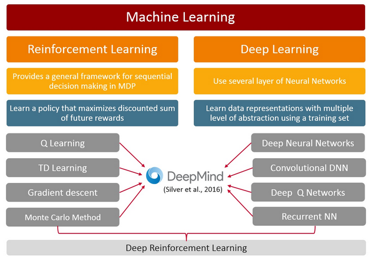

### 09.D. Algorithmes :
|Algorithms|Algorithmes|
|----------|-----------|
|Linear Regression|Régression linéaire|
|Logistic Regression|Régression logistique|
|Decision Tree|Arbre de décision|
|Clustering|Partitionnement de données|
|PCA (Principal Component Analysis)| ACP (Analyse en Composantes Principales)|
|KNN (K-Nearest Neighbors)|K plus proches voisins|
|Random Forest|Forêt d'arbres décisionnels|
|SVM (Support Vector Machine)|MVS (Machine à Vecteurs de Support)|
|GBM (Gradient Boosting Machine)|Engin d'augmentation du gradient|
|XGBoost (eXtreme Gradient Boosting)|Augmentation extrême du gradient|

## 10. Python libraries
|Domain|Librairies|
|------|---------|
|Machine Learning|scikit-learn, keras, orange|
|Web Scraping|beautifulsoup, selenium, scrapy|
|Deep Learning|tensorflow, pytorch|
|Data Visualization|matplotlib, seaborn|
|Data Analysis|pandas, numpy, scipy|
|Image Processing|pillow, opencv|
|Audio processing|Librosa|
|Natural Language processing|NLP, NLTK|
|Statistics|statsmodels|
## 11. JavaScript libraries
|Domain|Librairies|
|------|---------|
|Data Visualization|D3, DC, processing|
|Machine Learning|ml|
|Web Scraping|puppeteer|
## 12. R packages
|Domain|Packages|
|------|---------|
|Data Visualization|ggplot2, plotly, esquisse|
|Machine Learning|mlr3|
|Data analysis|dplyr|
|Web Scraping|RCrawler|
|Mics|Tedyverse, bioconductor, shiny|
## 13. Hadoop
## 14. Apache Spark
## 15. Tools : Tableau, PowerBI, Qlickview, Excel, etc.
## 16. Spunk

# XXV - Mobile development
## 01. Android
### 01.A. Plateforme : Android Studio
### 01.B. Langage : Java, Kotlin
## 02. iOS
### 02.A. Plateforme: Xcode
### 02.B. Language : Swift, ~~Objective-C~~
## 03. Cross-plateform
### 03.A. Flutter & Dart
### 03.B. JavaScript & React Native
### 03.C. Xamarin & C#
### 03.D. HTML5 & Apache Cordova
### 03.E. Ionix & JavaScript
## 04. PWA (Progressive Web App)

# XXVI - Core EIMS (Enterprise Information Management Systems) Software
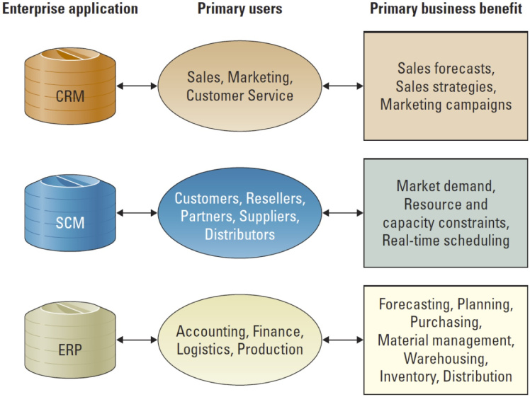

# XXVII - Législation
## 01. Propriété intellectuel et droit internet
## 02. Le RGPD (Règlement Général sur la Protection des Données) ou GDPR (General Data Protection Regulation
## 03. Hadopi (Haute Autorité pour la Diffusion des Œuvres et la Protection des droits sur Internet)
## 04. La CNIL (Commission Nationale de l'Informatique et des Libertés)
## 05. Les licences logiciels
### 05.A. Les quatre libertés fondamentales du logiciel libre :
#### 05.A.a. La liberté d'utiliser le logiciel ;
#### 05.A.b. La liberté d'étudier le logiciel ;
#### 05.A.c. La liberté de copier le logiciel ;
#### 05.A.d. La liberté de modifier le logiciel et de redistribuer les versions modifiées.

### 05.B. Logiciel propriétaire : 
#### 05.B.a. Par opposition au logiciel libre, un logiciel propriétaire ne garantit pas l'ensemble des quatre libertés du logiciel libre.

### 05.C Open-source : 
#### 05.C.a. Libre redistribution, d'accès au code source et de création de travaux dérivés
#### 05.C.b. Le code source est mis à la disposition du grand public, ce code source est généralement le résultat d'une collaboration entre programmeurs. 

### 05.D. Free Software Foundation :
#### 05.D.a. Organisation à but non lucratif dont la mission est la promotion du logiciel libre et la défense des utilisateurs.

### 05.E. Licence de logiciel permissive : 
#### 05.E.a. Licence publique générale GNU (GNU General Public License)
#### 05.E.b. Licence MIT : Licence de logiciel pour logiciels libres et open source, provenant de l'Institut de technologie du Massachusetts (MIT).
#### 05.E.c. Licence Apache : Licence de logiciel libre et open source. Elle est écrite par l'Apache Software Foundation. 
#### 05.E.d. Licence BSD (Berkeley Software Distribution License) : Elle permet de réutiliser tout ou une partie du logiciel sans restriction, qu'il soit intégré dans un logiciel libre ou propriétaire.

# XXVIII - Sécurité informatique
## 01. Surface web vs Deep web vs Dark web

### 01.A. Tails
### 01.B. Tor
### 01.C. onion sites
## 02. VPN (Virtual Private Network) :
## 03. Firewall (pare-feu) :
## 04. Windows defender :
## 05. Antivirus :
## 06. Proxy :
## 07. Pen test :
### 07.A. Kali linux
### 07.B. Metasploit
## 08. Le chiffrement (ou cryptage) vs le encrypter (ou encryption) :
## 09. Crypter / Cryptage vs Encrypter / Déencrypter :
## 10. Chiffrer / Déchiffrer :
## 1011. Les algorithmes de hashage :

### Salt (salage)
Certains algorithmes de hashage tel que MD5 ne sont pas du tout sécurisés, afin d'assurer plus de sécurité il existe la technique du salage, qui permet de concaténer un string généré aléatoirement au mot de passe original avant de le hasher.

## 12. Permutations and combination formulae
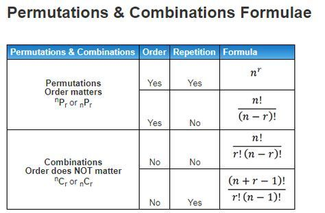
## 13. Password cracking techniques :
|Nom|Définition|
|---|----------|
|Bruteforce attack|Cherche à cracker un mot de passe, en testant toutes les combinaisons possible.|
|Dictionary attack|Cherche à cracker un mot de passe à  partir d'un dictionnaire, souvent grâce à un répertoire de mot de passe fréquemment utilisé dans le monde, généralement conçu à partir de fuites de données.|
|Hybrid attack|Attaque combinant l'attaque de la brute à celle de l'attaque par dictionnaire|
|Rainbow table attack|Consite à trouver un mot de passe à partir de son empreinte numérique (issue d'une fonction de hashage)|
|Phishing|Imitation d'un site internet de confiance de manière à trompé sa victime, ainsi il pensera être en lieu sûr et pourrait saisir ses identifiants qui seront transmit à l'attaquant.|
## 14. Les logiciels malveillants ou malwares 
### 14.A. Les chevaux de Troie :
Dissimulé dans un programme légitime ou des logiciel cracké, celui-ci va lancer un processus malveillant à l'insu de sa victime.. 
### 14.B. Rançongiciels (ransomwares) :
C'est un logiciel malveillant qui bloque l’accès aux données de la victime (souvent par chiffrement) et menace de les publier ou de les supprimer à moins qu’une rançon ne soit versée.
## 15. Les sniffer (analyseur réseau) : 
Permet d'écouter le trafic d'un réseau afin de capturer les informations qui y circulent.
## 16. Injection SQL : 
Résultant d'une faille de conception, l'attaque permet d'envoyer des requêtes dans un système afin de le saboter et/ou de dérober des informations.
## 17. MITM (Man in the middle attack) ou HDM (Attaque de l'homme du milieu) : 
L'objectif de cette attaque est d'intercepter les communications entre deux hôtes.
## 18. Backdoor (Porte dérobée) :
## 19. DDoS attack (Distributed Denial-of-Service attack) : 
Attaque ayant pour objectif de rendre impossible l'accès à un service. Par exemple en envoyant un nombre de requêtes tel que le réseau est inondé, le rendant hors d'usage.
## 20. Le drive-by download ou téléchargement furtif : 
Cette attaque infecte les ordinateurs des personnes présentant des failles de sécurités, à partir d'un virus présent sur une page d’un site internet non sécurisé.
## 21. Harponnage (spear phishing) :
## 22. Écoute clandestine :
Interception du traffic réseaux afin d’obtenir des mots de passe, des numéros de carte bleue et toutes données sensibles possibles.
Écoute clandestine passive – Un pirate détecte des informations en écoutant la transmission de messages sur le réseau.
Écoute clandestine active – Un pirate s’empare activement d’informations en se faisant passer pour une unité amie et en envoyant des requêtes aux transmetteurs. On appelle cela sonder, scanner ou saboter.
## 23. Cryptojacking :
Logiciels malveillants pour corrompre les systèmes et les ressources d’un appareil et pour exploiter la crypto-monnaie en arrière-plan et gagner de l’argent.
## 24. Les vers : 
Ce sont des programmes autonomes qui se propagent sur les réseaux et les ordinateurs.
Les vers se propagent généralement via les pièces jointes aux e-mails : l’ouverture de la pièce jointe active le programme du ver.
## 25. IP spoofing (Usurpation d'adresse IP)  :
Le pirate envoie à un hôte cible un paquet contenant l’adresse IP source d’un hôte connu et fiable au lieu de sa propre adresse IP source. Il est possible que l’hôte cible accepte le paquet et agisse en conséquence.
## 26. Social engiennering (ingénierie sociale) :
Exploitation des faiblesses psychologiques, sociales et plus largement organisationnelles des individus ou organisations pour obtenir quelque chose frauduleusement.
L’attaquant cherche à abuser de la confiance, de l’ignorance et de la crédulité de sa cible pour obtenir ce qu’il souhaite2.
## 27. Hijacking :
## 28. Honeypot (pot de miel) : piège à pirate qui consiste à attirer, sur des ressources (serveur, programme, service), des adversaires déclarés ou potentiels afin de les identifier et éventuellement de les neutraliser.
## 29. XSS (cross-site scripting) :
L’attaquant injecte un JavaScript malveillant dans la base de données d’un site Web. Lorsque la victime demande une page du site Web, le site Web transmet la page à son navigateur avec le script malveillant intégré au corps HTML
Il peut ainsi voler des informations sur les cookies, récupérer des données sensibles ou y injecter un code malveillant dans le but, par exemple, de contrôler l’ordinateur de sa victime à distance.
## 30. Site web des références des vulnérabilités connues : 
https://cwe.mitre.org/ (Common Weakness Enumeration) 

# XXIX - Management
## 01. Méthodologie
### 01.A. Agile
#### 01.A.a. Le manifeste agile
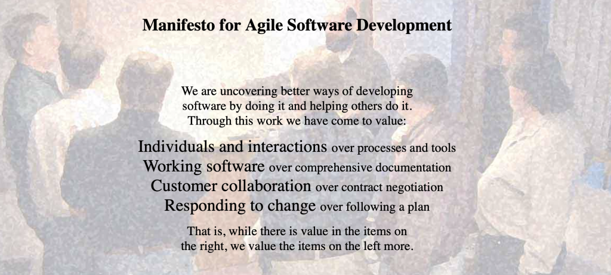
#### 01.A.b. Les principes du manifeste agile
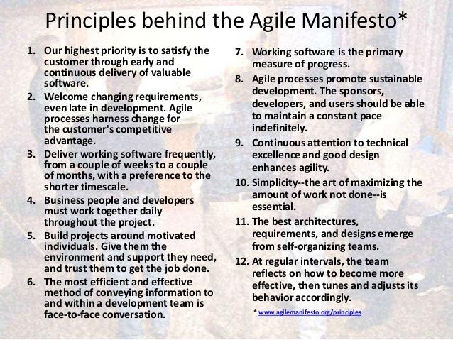
#### 01.A.c. Les frameworks agile - cf : stateofagile.com 14th annual report (2020)
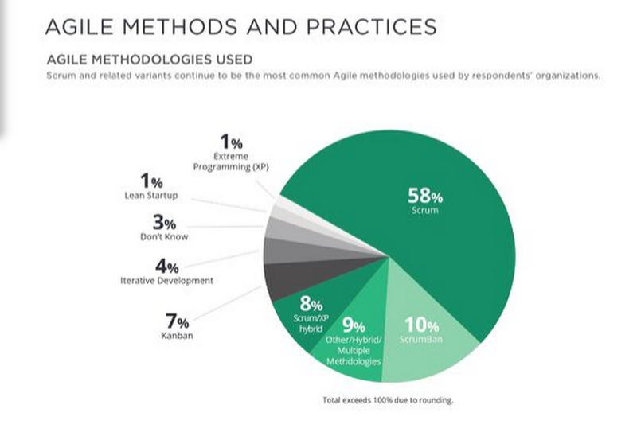
### 01.B. ITIL (Information Technology Infrastructure Library) :
C'est un ensemble de pratiques détaillées pour la gestion des services informatiques (ITSM) qui se concentre sur l'alignement des services informatiques avec les besoins des entreprises.
#### 01.B.a. Matrice des priorités

#### 01.B.b. Exemple de délais de résolution concernant la priorité des incidents
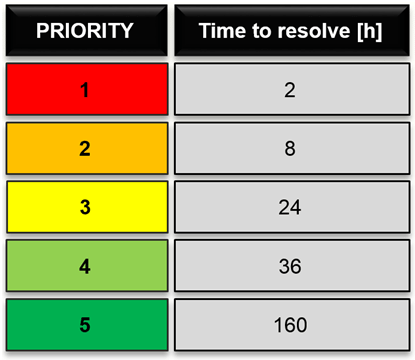

### 01.C. Lean management vs Six Sigma management vs Lean Six Sigma management
|Management method|Principe|
|-----------------|--------|
|Lean|Focus on eliminating waste|
|Six Sigma|Focus on eliminating variation|
|Lean Six Sigma|Combinaison of both|
## 02. Techniques
|Name|
|----|
|WBS (Work Breakdown Structure)|
|PERT (Program Evaluation and Review Technique)|
|CPM (Critical Path Method)|
|Gantt chart|
## 03. Lois de productivité :
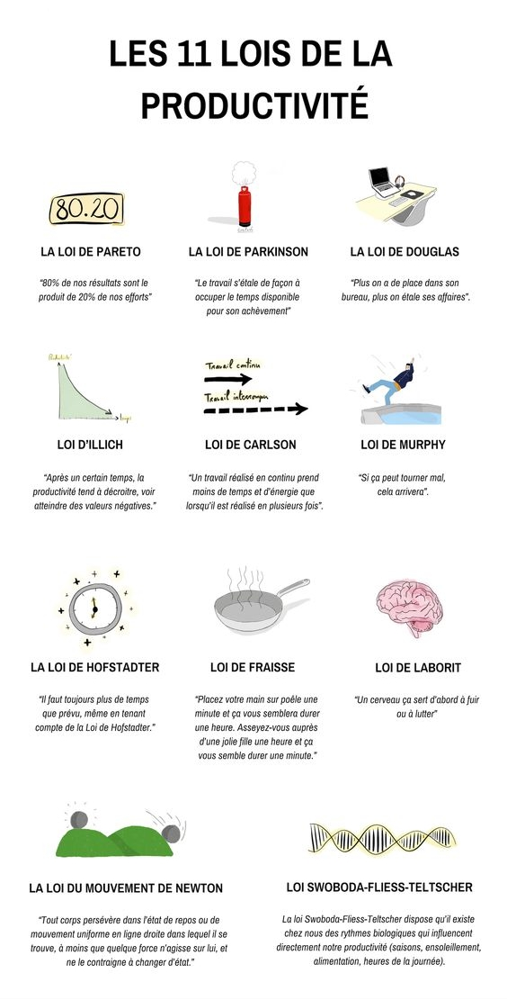
## 04. La matrice d'Eisenhower :
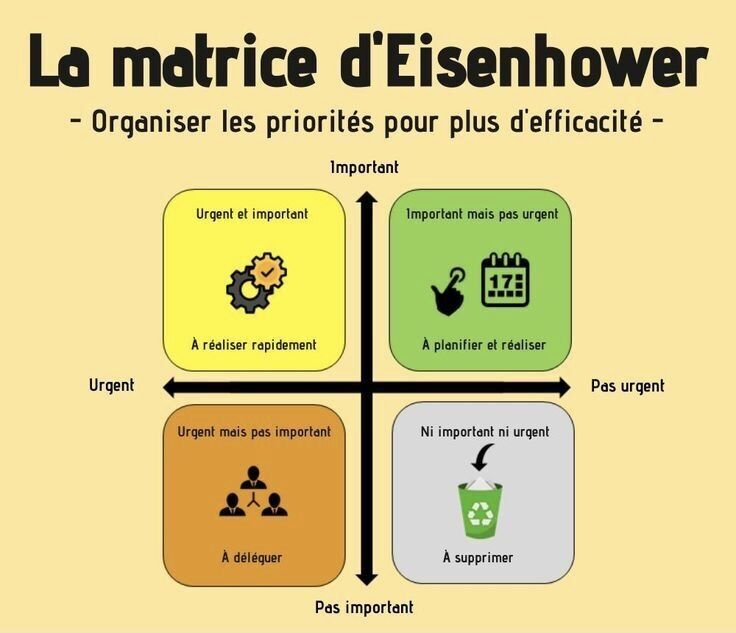

# XXX - Business operations
## 01. Strategic planning
|Step|Strategic Planning Process|
|----|--------------------------|
|1|Determine your strategic position.|
|2|Prioritize your objectives.|
|3|Develop a strategic plan.|
|4|Execute and manage your plan.|
|5|Review and revise the plan.|
## 02. Enterprise performance management (EPM)
### It describes methods and solutions that are required for enterprise management
|Management processes|
|--------------------|
|Budgeting, planning, forecasting|
|Modeling the value creation of a company|
|Consolidation of the results|
|Performance analysis|
## 03. Business intelligence and analytics (BA and BA)
|Comparison|Business Intelligence|Business Analytics|
|----------|---------------------|------------------|
|Definition|Analyses past and present to drive current business needs|Analyses past data to drive current business.|
|Usage|To run current business operations|To change business operations and improve productivity.|
|Ease of Operations|For current business operations|For future business operations.|
|Tools|SAP Business Objects, QlikSense, TIBCO, PowerBI etc.,|Word processing, Google docs, MS Visio, MS Office Tools etc.|
|Applications|Apply to all large-scale companies to run current business operations|Applies to companies where future growth and productivity as its goal.|
|Field|Comes under Business Analytics|Contains Data warehouse, information management etc.|
## 04. Key performance indicators (KPI)
### Measure your performance against key business objectives
## 05. Management reporting
### Reports that management uses to run the organization, make business decisions, and monitor progress. 
|Objectives|
|----------|
|Measure and monitor specific performance metrics and KPIs.|
|Understand your status, health and what you should do next.|
|Determine benchmarks.|
|Ensure better communication between stakeholders, colleagues, and executives.|
|Guide your next steps.|
|Force you to have an action plan.|
|Monitor performance frequently.|
## 06. Strategic decision making
### Strategic decision-making is the process of charting a course based on long-term goals and a long-term vision. By clarifying the company's overall objectives, the ability to align short-term plans with this deeper and broader mission, giving operations clarity and consistency.

# XXXI - Game development
## 01. Game engine
|Game engine|Language|
|-----------|--------|
|Unity|C#|
|Unreal Engine|C++|
|Godot|C#, C++, etc.|
## 02. Sprintes : Ce sont des éléments graphiques d'un jeu vidéo pouvant se déplacer sur l'écran.
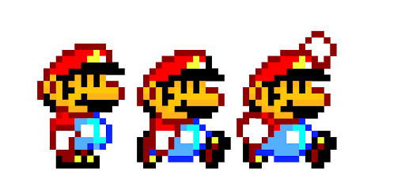
## 03. Ray casting : Il s'agit d'une technique de calcul d'images de synthèse 3D

# XXXII - Low-code vs No-code
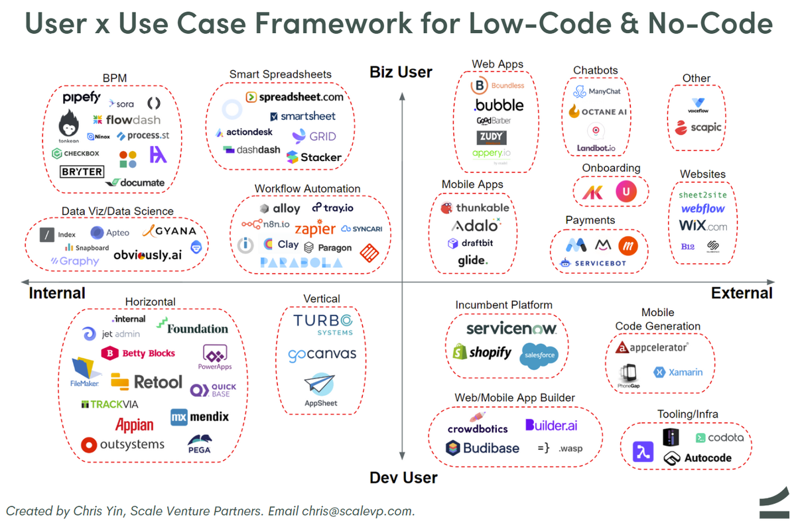
