# DevUniverse
## 00. Environnement de développement
###	• Environnement virtuel (pipenv, etc.)
### • IDE or Text Editor ? (VSC, Vim, Notepad++, outils Jetbrains, etc.)
### • Cloud plateform: Jupyter, Collab, etc.
### • Package manager : anaconda (data science), npm (node), pip (python), etc.
### • Raccourcis de productivité
## 01. Les types de données
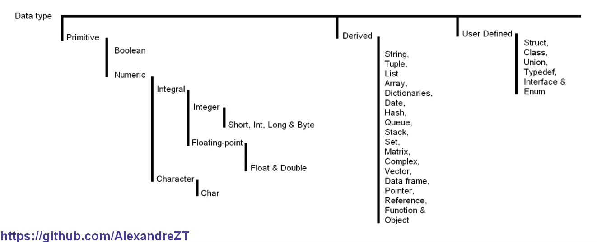
### • La table ASCII
### • Les caractères d'échappement
### • Les regex

### • Les opérateurs
#### - addition / incrémentation / concaténation
#### - soustraction / décrémantion / déconcaténation
#### - multiplication
#### - division
#### - puissance
#### - modulo

## 02. Structures conditionnelles
### • La comparaison
#### - supérieur à
#### - inférieur à
#### - égal à
#### - différent de
#### - supérieur ou égal à
#### - inférieur ou égal à

### • Les opérateurs AND, OR, NOT
###	• Les boucles : while / do…while (repeat… until) & for.

###	• Les conditions : if…else & switch.

###	• Contrôle de boucles : repeat, break, next, continue, pass & txtProgressBar.

##	03. Les principaux paradigmes de programmation
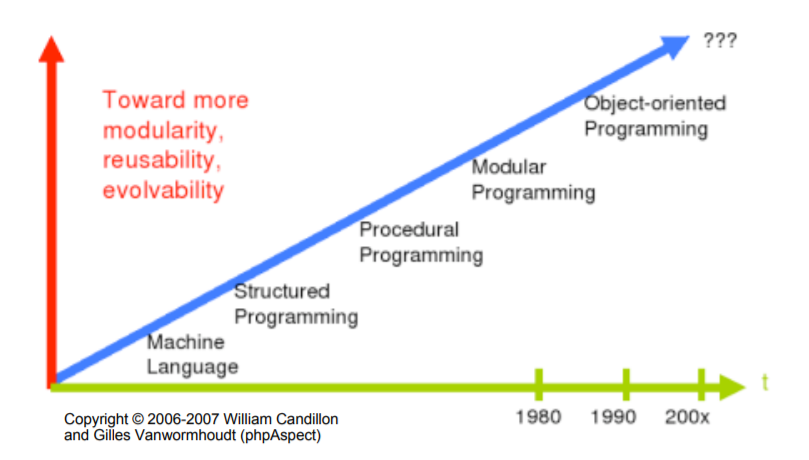
##	04. Fonctions, procédures et arguments

##	05. Built-in functions

##	06. Les librairies principales

##	07. Spécificité et bonnes pratiques du langage
###	• Point forts et faiblesses

###	• Les commentaires 
#### - Single Line Comment

#### - Multi Line Comment
#### - Documentation Comment

###	• Convention de nommage (classe, méthode, fonctions, constante, variable, module, package, etc.)
#### - Pascal Case : FirstName
#### - Camel Case : firstName
#### - Screaming Case : FIRSTNAME
#### - Snake Case : first_name
#### - Kebab case : first-name
#### - Hungarian Notation : strFirstName

## 08. Les langages interprétés vs compilés + Input/Output
###	• La compilation
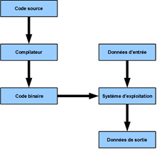
### • L'interprétation
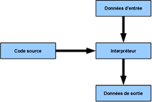

## 09. OOPs (Object-Oriented Programming System)

### Classes, Object
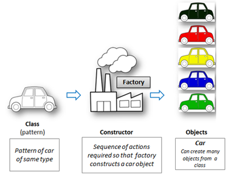
### Inheritance
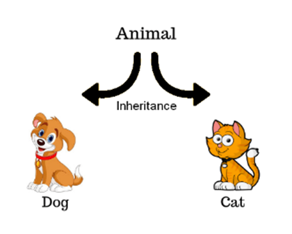
### Polymorphism

### Abstraction 
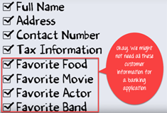
### Encapsulation (public, private & protected)
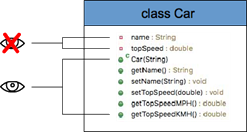
### Coupling vs Cohesion
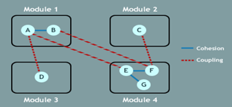
### Association
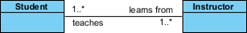
### Aggregation (uses)
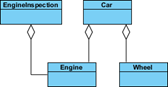
### Composition (owns)
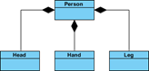
### Generalization and specialization
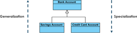
## 10. Développement web
###	La standardisation W3C, ECMAScript, RFC, etc.
###	CMS (Content Management System) : #1 WordPress, #2 Drupal, #3 Shopify, etc
###	Référencement nuturel SEO (Search Engine Optimisation)
###	Référencement payant SEA (Search Engine Advertising)
###	Visibilité sur les réseaux SMO (Social Media Optimization)
### Techniques de visivilité SEM (Search Engine Marketing) = SEO + SEA + SMO
###	Front-end technologies :

### Qu’est-ce que le DOM (Document Object Model)
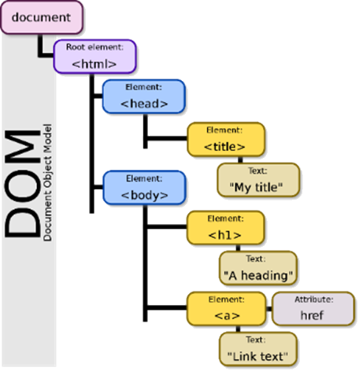
###	L’essentiel des tags HTML et des styles CSS
###	JavaScript :
#### Dynamisation des pages
#### Manipulation du DOM avec la librairie jQuery
#### Les fonctions à flèches depuis l’ES6.
#### L’asynchronisme avec les promesses (promise, resolve, reject)
### Framework JS : 
#### #1 React
#### #2 Angular
#### #3 Vue.js
### Framework CSS : #1 Bootstrap, #2 Semantic UI
###	Créer une maquette (tous les écrans d’une app) et les coder
#### #1 Adobe XD (Windows et Mac) / #2 Sketch (Mac) 
###	SPA (Single Page Application) vs MPA (Multi Page Application)
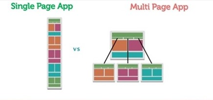
###	Back-end technologies :  
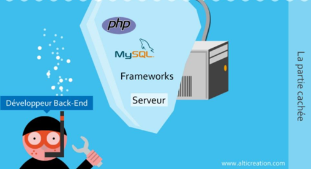
#### Server framework :
##### Node : #1 Express.js (Jest, Mocha, Jasmine, Karma, selenium, etc)
##### Python : #1 Django et #2 Flask (unittest, selenium, etc)
##### PHP #1 Laravel et #2 Symfony (testunit, etc)
##### Java : #1 Spring (JUnit, selenium, etc)
##### C# : #1 ASP.NET (MSTest, selenium, etc)

#### Les architecture web : MVC vs MVT (django)

#### Web services (deux grandes familles) :
##### SOAP/XML (WS)
###### Simple Object Access Protocol
###### Extensible Markup Language
##### REST/JSON (API)
###### REpresentational State Transfer
###### JavaScript Object Notation
#### Communication client/serveur 
##### La méthode AJAX (Asynchronous JavaScript And XML)
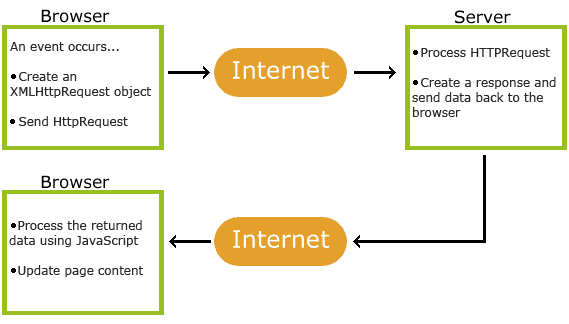
##### Les protocoles internet :
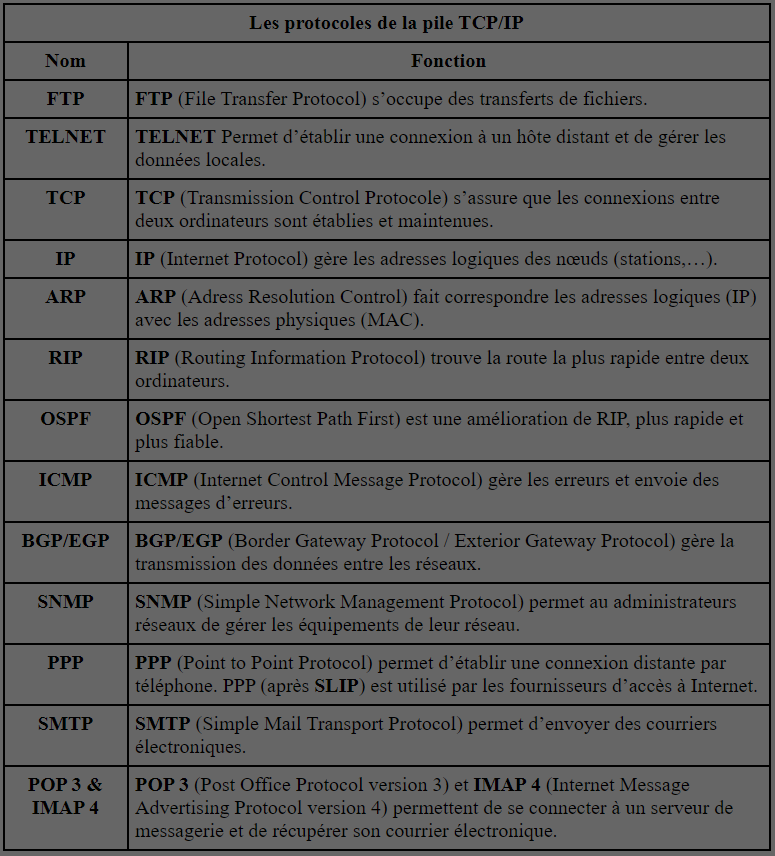
##### Le modèle OSI et le modèle TCP/IP

##### Duplex (canal de communication)
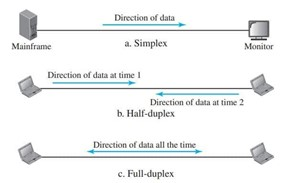
###### Les Websockets sont une spécification full-duplex du protocole HTTP
####### Utilisé pour le développement de messagerie instantanée
## 11. Base de données 
### RDBMS / SGBDR :
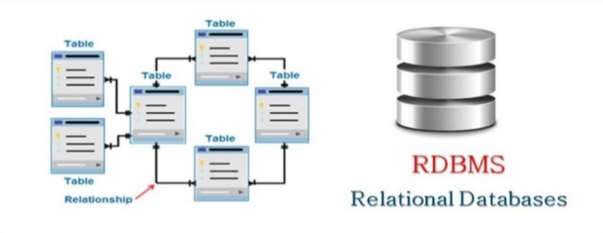
#### Propriétaire : #1 Oracle, #2 Microsoft Server #3 MySQL
#### Libre : #1 PostegreSQL #2 MariaDB, #3 SQLite
### OLTP (Online Transactional Processing) / OLAP (Online analytical processing)
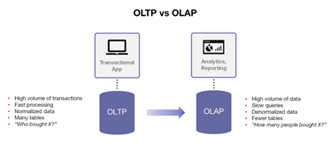
### SQL
#### DDL (data definition language) : to create data
#### DML (data manipulation language) : to manipulate data
#### DCL (data control language) : assigment and removal of permissions to use this data
#### TCL (transaction control language) : saving and restoring changes to a database
#### Les jointures

### NoSQL databases :
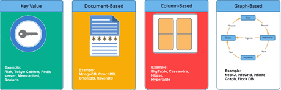
### Les services cloud : #1 Azure, #2 AWS, #3 Google cloud,  #4 Alibaba cloud
### ORM (Object-Relational Mapping)
## 12. La mémoire : 
### Allocation statique vs dynamique
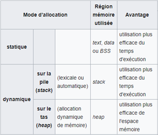
### Stockage de la mémoire
#### Queue allocation (la file)
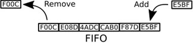
#### Stack allocation (la pile)
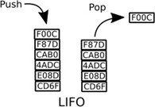
#### Heap allocation (le tas)
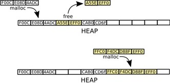
### Les pointeurs

## 13. File management (read, write, append, create, etc.)
### Les types de fichiers (TXT, CSV, JSON, PDF, etc.)
## 14. Les algorithmes (voir : project euler)
### Sort Algorithms (Merge Sort, Quick Sort, Bucket Sort, Heap Sort, Counting Sort)
### Search Algorithms (Binary search, Depth/Breadth First Search)
### Hashing
### Dynamic Programming
### Exponentiation by squaring
### String Matching and Parsing (KMP Algorithm, Regular Expression)
### Primality Testing Algorithms
## 15. Les tests
### Classification : 
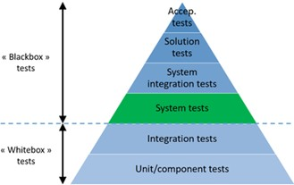
### Autres :
#### End-to-End testing (e2e)
#### Tests de non-régression
#### Test fonctionnels et non fonctionnels
#### Smoke test and sanity check
#### Proof of Concept (PoC)
## Exception Handling :
### try… raise/catch/except…finally/except
### throws…throw
## 16. Les designs patterns (outil apporte des solutions aux problèmes communs de développement logiciel en rendant le code flexible, réutilisable et maintenable)
### Il existe 3 grand type de design pattern
#### Creational « factory » : création
#### Behavioral: comportemental
#### Structural : structurante
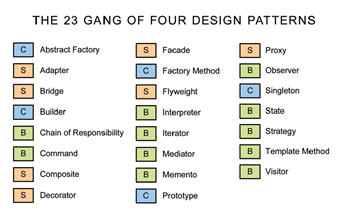
## 17. Documentation logicielle
### L'expression de besoin 
#### Définit le besoin du métier lors d'une demande.
### Architecture / Conception : diagrammes UML)
#### Vue d'ensemble sur le logiciel. Elle inclut les relations à l'environnement et les principes à utiliser dans la conception et la réalisation des composants logiciels.
### Technique
#### Documentation du code, algorithmes, interfaces, et interfaces de programmation (API).
### Utilisateur
#### Manuels pour les utilisateurs, administrateurs systèmes et personnel de support.
### Marketing
#### Instructions sur le produit et garantie promotionnelle.
## 18. L’architecture des ordinateurs (Taxonomie de Flynn)
### Single Instruction on Single Data
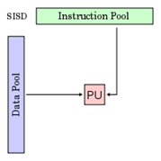
### Multiple Instructions on Single Data
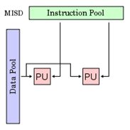
### Single Instruction on Multiple Data
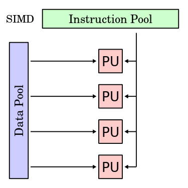
### Multiple Instructions on Multiple Data 
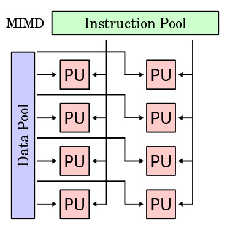
## 19. Single-Thread vs Multi-Thread programming
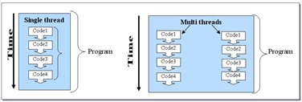
## 20. Synchronous vs Asynchronous programming 
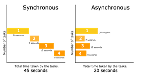
## 21. DevOps
### Git & Git CLI (#1 GitHub, #2 Gitlab, #3 Bitbucket)

### Semantic versioning
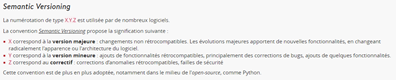
### Linux : le shell (bash) et les scripts

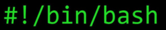
### Protocole SSH (Secure SHell)

### Docker vs Kubernetes

## 21. Data Science
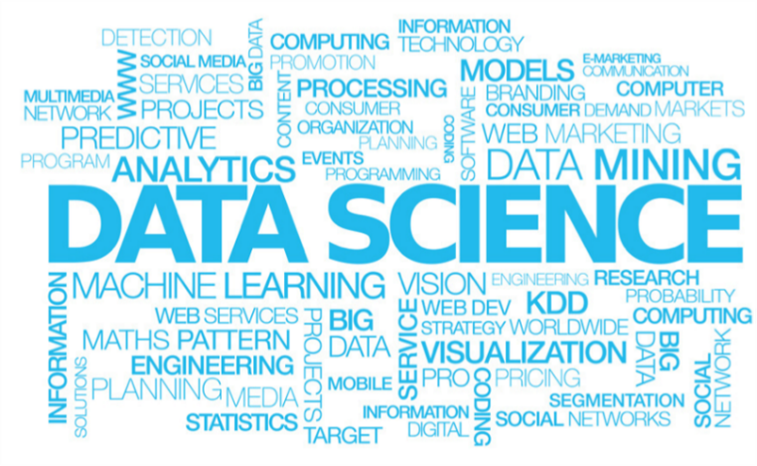
### Types de données :
#### Numérique :
##### discrète : prendre une seule valeur entière
##### continue : peut prendre une infinité de valeur
#### Catégorique :  Ne peut-être mesuré, comme une couleur, un booléen, etc.
#### ordinal : Simillaire aux données catégorique, à la différence qu'on peut distinguer les valeurs prises, comme la note A est meilleur qu'une note B.
### Mathématique
#### Linear algebra (algèbre linéaire)
##### Matrix (matrice)
### Statistique
#### Mean (moyenne) : Résume une série de valeur en un seul nombre réel. Il s'agit de la somme des valeurs d'une série divisé par son nombre d'élément.
#### Median (Médiane) : Permet de partager une série de valeur en deux parties de même nombre d'élément. Il s'agit de la valeur du milieu d'une sérieu rangé par ordre croissant.
#### Mode (mode) : Permet de connaître la (ou les) valeur(s) la (ou les) plus fréquante(s) dans une série. Il s'agit d'une valeur ayant le plus de récurrence dans une série.
#### Variance (variance) : Mesure de la dispertion des valeurs d'unéchantillon ou d'une distribution de probabilité (sans tenir compte des signes).
#### Standard deviation (écart-type) :  Mesure de la dispertion des valeurs à partir de la moyenne.
#### Confidence Interval (Intervalle de confiance) : Défini une marge d'erreur dans un résultat. Le dégré de confiance est souvent défini à 95%, ce qui signifi qu'en moyenne, 95% des résultats seront correct.
#### Expected value (espérance) : Représente la valeur que l'on s'attend à trouver, en moyenne, si 'lon répète un grand nombre de fois la même expérience aléatoire. Il s'agit d'une moyenne pondérée par les probabilités d'apparition de chaque valeur.
#### Percentile (percentile) : Décrit la valeur à laquelle un pourcentage donné des valeurs est inférieur.
#### Quantiles : divisent un jeu de données en intervalles contenant le même nombre de données.
#### RMSE (ROOT MEAN SQUARE ERROR)
#### R-squared : mesure la qualité de la prédiction d'une régression linéaire, ainsi la qualité du model utilisé.
#### L'échatillonnage : On essaye de représenter une population à partir d'un sous ensemble. Les types d'échantillons sont : aléatoire, arbitraire, par itinéraire et par quotas.
#### p-value : est la probabilité pour un modèle statistique donné sous l'hypothèse nulle d'obtenir la même valeur ou une valeur encore plus extrême que celle observée.
### Probabilité
#### Normal distribution / Gaussiandistribution (loi normal ou loi de Gauss) : La loi normale (ou loi de Gauss) permet de modéliser des phénomènes naturels issus de plusieurs évènements aléatoires.
#### Continuous uniform distribution / rectangular distribution (loi uniforme continue ou loi rectangulaire) : La loi uniforme continue (ou loi rectangulaire) a pour propriétéque la densité de probabilités deceslois est constante sur leur support.
#### Discrete uniform distribution (loi uniforme discrète) : La loi uniforme discrète est uneloi indiquantune probabilité de se réaliser identiqueà chaque valeur d'un ensemble fini de valeurs possibles.
#### Binomial distribution (loi binomiale) : La loi binomiale modélise la fréquence du nombre de succès obtenus lors de la répétition de plusieurs expériences aléatoires identiques et indépendantes.
#### Poisson distribution (loi de poisson) : La loi de poisson est une loi qui décrit le comportement du nombre d'évènement se produisant dans un intervalle de temps fixé.
### Big Data
### Intelligence artificielle
#### Les réseaux neuronaux
##### Weight : importance de l'influence de l'input sur l'output
##### Biais : constante d'ajustement
##### Softmax activation
### La blockchain
### Time series
### Machine learning :
#### Augmenter la précision du modèle :
##### Ajouter des données
##### Traiter les valeurs manquantes ou aberrantes
##### Transformer et créer des variables
##### S'appuyez sur les connaissances du domaine, la viz, la p-value ou le PCA (principal component analysis)
##### Utiliser un autre algorithme (trouver le meilleur)
##### Trouver les paramètres idéaux
##### Combiner les résultats de différents modèle : bagging & boosting
##### Le Surentrainement rend une modèle inprécis
##### La cross-validation : laisser un échantillion sans entrainement pour le tester plus tard après l'entrainement
#### Classification VS Régression
#### Apprentissage : supervisé, non/semi-supervisé, par renforcement et incrémental
#### Algorithmes (k-moyennes / proches voisins, etc.)
### Python libraries
#### Machine Learning : scikit-learn, keras, orange
#### Web Scraping : beautifulsoup, selenium, scrapy
#### Deep Learning : tensorflow, pytorch
#### Data Visualization : matplotlib, seaborn
#### Data Analysis : pandas, numpy, scipy
#### Image Processing : pillow, opencv
#### Audio processing : Librosa
#### Natural Language processing : NLP, NLTK
#### Statistique : statsmodels
### JavaScript libraries
#### Web Scraping : puppeteer.js
#### Data Visualization : D3.js, DC.js
#### Machine learning : ml.js
### R package
#### Data Visualization : ggplot2, plotly, esquisse
#### Machine Learning : mlr3
#### Data analysis : dplyr
#### Web Scraping : RCrawler
#### Mics : Tedyverse, bioconductor, shiny
### Hadoop
### Apache Spark
## 22. Mobile development
### Android
#### Plateforme : Android Studio
#### Langage : Java, Kotlin
### iOS
#### Plateforme: Xcode
#### Language : Swift, ~~Objective-C~~
### Cross-plateform
#### Flutter & Dart
#### JavaScript & React Native
#### Xamarin & C#
#### HTML5 & Apache Cordova
## 23. ERP VS CRM
## 24. Législation
### Propriété intellectuel et droit internet
### RGPD
### Hadopi
## 25. Management
### Méthodologie
#### Agil
#### Les 12 principes fondamentaux
### Outils
#### GANTT
